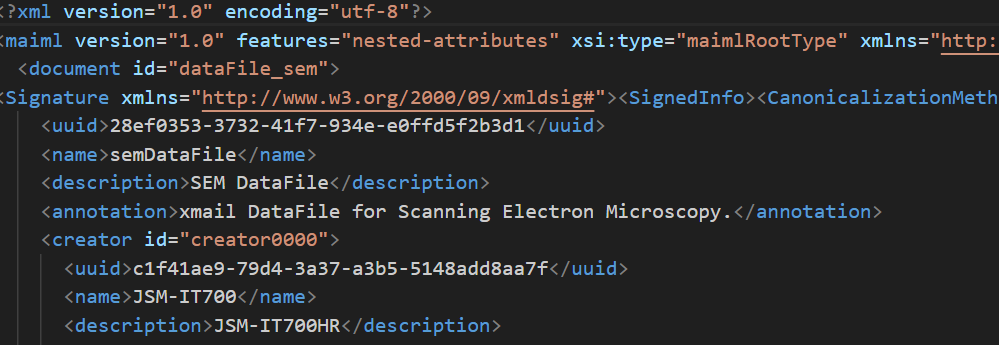
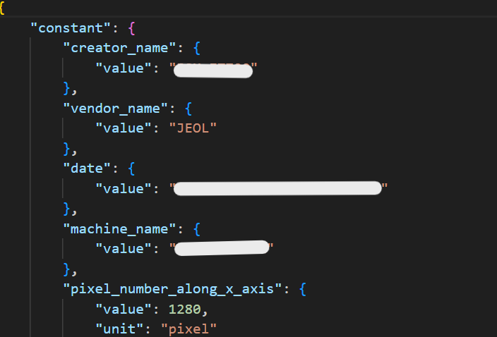
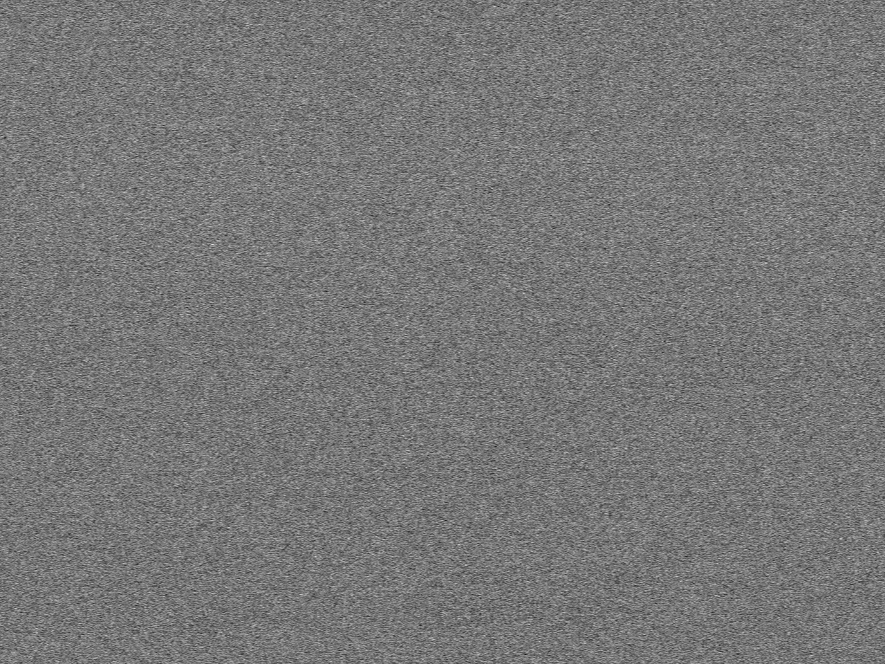
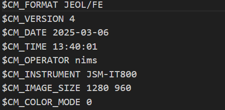
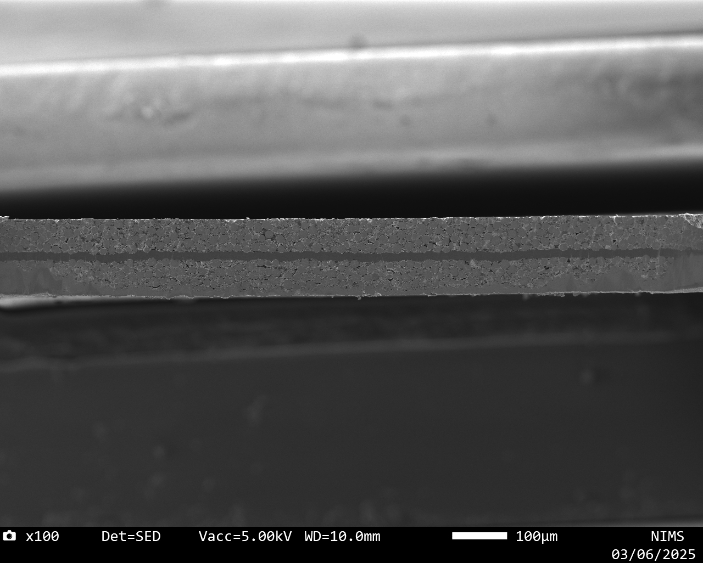
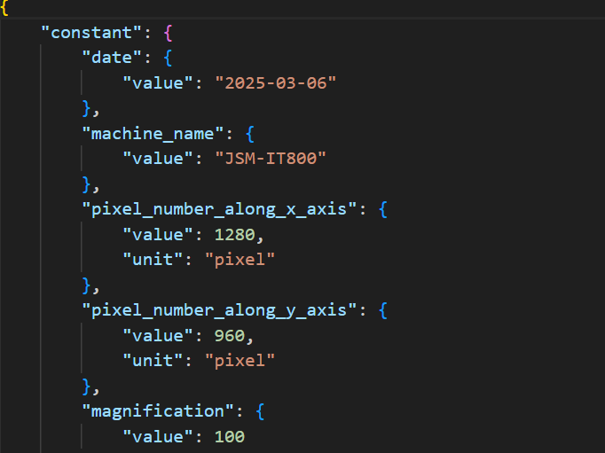
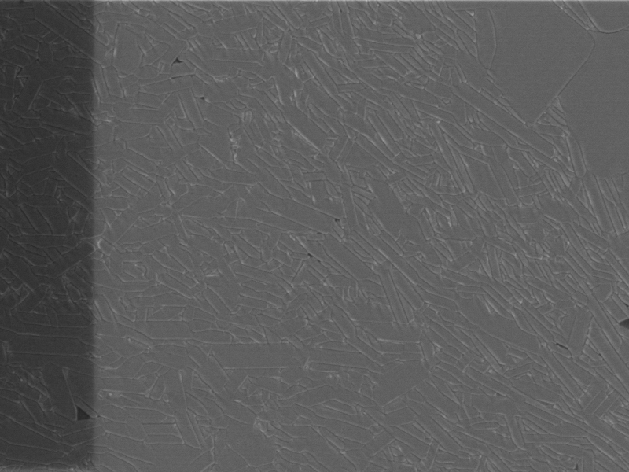
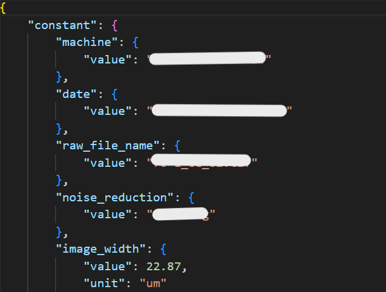
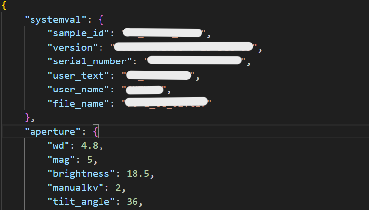

# SEMデータセットテンプレート

## 概要

SEM(走査電子顕微鏡)をご利用の方に適したテンプレートです。3つの入力フォーマットに対応しており、日本電子（JEOL）製SEM装置のmaiml形式およびjpg／png／tif形式、ならびにZEISS製SEM装置の熱間圧延によるtif形式（熱間圧延SEM画像）に対応しています。<br>
SEMの専門家によって監修されたメタ情報をデータファイルから自動的にRDEが抽出します。

## カタログ番号

本テンプレートには、測定データの違いによって以下のバリエーションが提供されています。
- DT0021
    - JEOL_maiml
- DT0022
    - JEOL_fe
- DT0023
    - ZEISS

## 対象とする装置

- JEOL_maimlテンプレート:
  - 対象装置: なし
- JEOL_feテンプレート:
  - 対象装置: なし
- ZEISSテンプレート:
  - 対象装置:
    - FIB-SEM複合装置 Helios G4 UX DualBeam
    - FIB-SEM複合装置 Helios 5 UX DualBeam
    - FIB-SEM複合装置 Crossbeam1540EsB
    - FIB-SEM複合装置 Crossbeam550

### 入力ファイル

#### JEOL_maimlテンプレート

|No.|内容|必須|ファイル名|
|:----|:----|:----|:----|
|1|maimlファイル|〇|{filename}.maiml|
|2|maimlに記載された画像ファイル（拡張子: .bmp, .tif, .png, .jpg, .jpeg）||{filename}.bmp|
|3|その他ファイル||{filename}.txt 等|
- maimlファイル内の resultTemplate_semResultImage に記載された画像ファイルを、代表画像として取り扱います。
- resultTemplate_semResultImage に記載されたファイル名と一致しない画像ファイルは、代表画像として登録されません。
#### JEOL_feテンプレート

||内容|必須|ファイル名|
|:----|:----|:----|:----|
|1|メタ情報ファイル|〇|{filename}.txt|
|2|画像ファイル（拡張子: .tif, .png, .jpg, .jpeg）|〇|{filename}.jpg|

 - SEM画像ファイルとメタ情報ファイル（txt）は、拡張子を除き同一のファイル名とし、1組のデータとして zip 形式にまとめて登録してください。
   - （例：sample01.jpg と sample01.txt を同一 zip に格納）
#### ZEISSテンプレート

||内容|必須|ファイル名|
|:----|:----|:----|:----|
|1|tif形式のファイル（拡張子: .tif, .tiff）|〇|{filename}.tif|

#### 入力ファイルの仕様

- いずれのファイルも命名規則はありません。

### 出力ファイル

#### JEOL_maimlテンプレート
| ファイル名                 | 内容          | 備考                                  |
| :-------------------- | :---------- | :---------------------------------- |
| {filename}.maiml        | rawデータファイル    |  |
| {filename}.bmp          | rawデータファイル  |              |
| {filename}.txt   | rawデータファイル |          |
| metadata.json | maimlから抽出した主要メタ情報ファイル   |     |
| {filename}.png   | 代表画像ファイル（PNG形式に変換して登録）    |       |

#### JEOL_feテンプレート
| ファイル名                  | 内容          | 備考                                          |
| :--------------------- | :---------- | :------------------------------------------ |
| {filename}.jpg | rawデータファイル |  |
| {filename}.txt           | rawデータファイル |      |
| {filename}.png    | 代表画像ファイル（PNG形式に変換して登録）   |     |
| metadata.json  | 主要メタ情報ファイル    |            |


#### ZEISSテンプレート
| ファイル名                       | 内容         | 備考                             |
| :-------------------------- | :--------- | :----------------------------- |
| {filename}.tif                | rawデータファイル |       |
| {filename}.png         | 代表画像ファイル（PNG形式に変換して登録）   |     |
| metadata.json       | 主要メタ情報ファイル   |             |
| tif_info.json | tif画像の基本情報をJSON形式で整理したファイル  |     |


### メタ情報

次のように、大きく4つに分類されます。

- 基本情報
- 固有情報
- 試料情報
- 抽出メタ情報

#### 基本情報

基本情報はすべてのデータセットテンプレート共通のメタです。詳細は[データセット閲覧 RDE Dataset Viewer > マニュアル](https://dice.nims.go.jp/services/RDE/RDE_manual.pdf)を参照してください。

#### 固有情報

固有情報はデータセットテンプレート特有のメタです。以下は本データセットテンプレートに設定されている固有メタ情報項目です。
##### JEOL_maimlテンプレート
|項目名|必須|日本語名|英語名|データ型|初期値|単位|備考|
|---|--|---|---|---|---|--|---|
|common_data_origin||データの起源|Data Origin|string|experiments|||
|common_data_type||登録データタイプ|Data Type|string|SEM|||
|common_reference||参考文献|Reference|string||||
|common_technical_category||技術カテゴリー|Technical Category|string|measurement|||
|key1||キー1|key1|string|||汎用項目|
|key2||キー2|key2|string|||汎用項目|
|key3||キー3|key3|string|||汎用項目|
|key4||キー4|key4|string|||汎用項目|
|key5||キー5|key5|string|||汎用項目|
|measurement_analysis_field||分析分野|Analysis field|string||||
|measurement_energy_level_transition_structure_etc_of_interst||対象準位_遷移_構造|Energy level_transition_structure etc. of interst|string||||
|measurement_instrumentation_site||装置設置場所|Instrumentation site|string||||
|measurement_measured_date||分析年月日|Measured date|string|||format:date|
|measurement_measurement_environment||測定環境|Measurement environment|string||||
|measurement_method_category||計測法カテゴリー|Method category|string|顕微法|||
|measurement_method_sub_category||計測法サブカテゴリー|Method sub-category|string|走査電子顕微鏡|||
|measurement_standardized_procedure||標準手順|Standardized procedure|string||||


##### JEOL_feテンプレート
|項目名|必須|日本語名|英語名|データ型|初期値|単位|備考|
|---|--|---|---|---|---|--|---|
|area_information||エリア情報|area_information|string||||
|common_data_origin||データの起源|Data Origin|string|experiments|||
|common_data_type||登録データタイプ|Data Type|string|SEM|||
|common_reference||参考文献|Reference|string||||
|common_technical_category||技術カテゴリー|Technical Category|string|measurement|||
|measurement_analysis_field||分析分野|Analysis field|string||||
|measurement_energy_level_transition_structure_etc_of_interest||対象準位_遷移_構造|Energy Level_Transition_Structure etc. of interest|string||||
|measurement_instrumentation_site||装置設置場所|Instrumentation site|string||||
|measurement_measured_date||分析年月日|Measured date|string||||
|measurement_measurement_environment||測定環境|Measurement environment|string||||
|measurement_method_category||計測法カテゴリー|Method category|string|顕微法|||
|measurement_method_sub_category||計測法サブカテゴリー|Method sub-category|string|走査電子顕微鏡|||
|measurement_standardized_procedure||標準手順|Standardized procedure|string||||


##### ZEISSテンプレート
|項目名|必須|日本語名|英語名|データ型|初期値|単位|備考|
|---|--|---|---|---|---|--|---|
|id||ID|ID|string|||固有情報の識別子|
|mode||測定モード|mode|string（列挙）|||`Manual`/`Auto`/`None`のいずれか<br>※CrossBeam550選択時のみ有効|
|method_category||計測法カテゴリー|Method category|string||||
|method_sub-category||計測法サブカテゴリー|Method sub-category|string|||計測法カテゴリーの詳細分類|
|measurement_environment||測定環境|Measurement environment|string|||例：真空中、大気中など|
|energy_level_transition_structure||対象準位_遷移_構造|Energy level_transition_structure|string|||解析対象の準位や遷移構造など|
|measurement_measured_date||分析年月日|Measured date|string（date形式）|||yyyy-mm-dd形式の日付|
|standardized_procedure||標準手順|Standardized procedure|string|||分析の標準手順や参照プロトコル|
|instrumentation_site||装置設置場所|Instrumentation site|string|||例：「千現」「並木」など|
|reference||参考文献|Reference|string|||関連文献などの参照情報|


#### 試料情報

試料情報は試料に関するメタで、試料マスタ（[データセット閲覧 RDE Dataset Viewer > マニュアル](https://dice.nims.go.jp/services/RDE/RDE_manual.pdf)参照）と連携しています。以下は本データセットテンプレートに設定されている試料メタ情報項目です。

|項目名|必須|日本語名|英語名|単位|初期値|データ型|フォーマット|備考|
|:----|:----|:----|:----|:----|:----|:----|:----|:----|
|sample_name_(local_id)|o|試料名(ローカルID)|Sample name (Local ID)|||string|||
|chemical_formula_etc.||化学式・組成式・分子式など|Chemical formula etc.|||string|||
|administrator_(affiliation)|o|試料管理者(所属)|Administrator (Affiliation)|||string|||
|reference_url||参考URL|Reference URL|||string|||
|related_samples||関連試料|Related samples|||string|||
|tags||タグ|Tags|||string|||
|description||試料の説明|Description |||string|||
|sample.general.general_name||一般名称|General name|||string|||
|sample.general.cas_number||CAS番号|CAS Number|||string|||
|sample.general.crystal_structure||結晶構造|Crystal structure|||string|||
|sample.general.sample_shape||試料形状|Sample shape|||string|||
|sample.general.purchase_date||試料購入日|Purchase date|||string|||
|sample.general.supplier||購入元|Supplier|||string|||
|sample.general.lot_number_or_product_number_etc||ロット番号、製造番号など|Lot number or product number etc|||string|||

#### 抽出メタ

抽出メタ情報は、データファイルから構造化処理で抽出したメタデータです。以下は本データセットテンプレートに設定されている抽出メタ情報項目です。入力フォーマット別に表示します。

---
##### JEOL_maimlテンプレート
|項目名|取得元|日本語名|英語名|データ型|単位|初期値|備考|
|---|---|---|---|---|---|---|---|
|creator_name|document/creator/name|作成者|Creator Name|string||||
|vendor_name|document/vendor/name|ベンダー名|Vendor Name|string||||
|date|data/results/condition[@ref="conditionTemplate_semMeasurement"]/property[@key="dateTime"]/value|画像取得日|Date|string||| |
|machine_name|data/results/condition[@ref="conditionTemplate_semMeasurement"]/property[@key="instrument"]/value|装置名|Machine name|string||| |
|pixel_number_along_x_axis|data/results/condition[@ref="conditionTemplate_semMeasurement"]/property[@key="imageSizeX"]/value|x方向の画素数|Pixel number along x axis|number|pixel|| |
|pixel_number_along_y_axis|data/results/condition[@ref="conditionTemplate_semMeasurement"]/property[@key="imageSizeY"]/value|y方向の画素数|Pixel number along y axis|number|pixel|| |
|magnification|data/results/condition[@ref="conditionTemplate_semMeasurement"]/property[@key="magnification"]/value|画像倍率|Magnification|number||| |
|coordinates_of_x_axis|data/results/condition[@ref="conditionTemplate_semMeasurement"]/property[@key="stagePositionX"]/value|x方向の撮影座標|Coordinates of x axis|number|mm|| |
|coordinates_of_y_axis|data/results/condition[@ref="conditionTemplate_semMeasurement"]/property[@key="stagePositionY"]/value|y方向の撮影座標|Coordinates of y axis|number|mm|| |
|acceleration_voltage|data/results/condition[@ref="conditionTemplate_semMeasurement"]/property[@key="acceleratingVoltage"]/value|加速電圧|Acceleration voltage|number|kV|| |
|pixel_actual_size_along_x_axis|data/results/condition[@ref="conditionTemplate_semMeasurement"]/property[@key="fieldOfViewX"]/value|x方向の実サイズ|Pixel actual size along x axis|number|um|| |
|pixel_actual_size_along_y_axis|data/results/condition[@ref="conditionTemplate_semMeasurement"]/property[@key="fieldOfViewY"]/value|y方向の実サイズ|Pixel actual size along y axis|number|um|| |
|pixel_size|data/results/condition[@ref="conditionTemplate_semMeasurement"]/property[@key="pixelSize"]/value|画素サイズ|Pixel size|number|nm/pixel|||
|working_distance|data/results/condition[@ref="conditionTemplate_semMeasurement"]/property[@key="workingDistance"]/value|作動距離|Working distance|number|mm|| |
|detector|data/results/condition[@ref="conditionTemplate_semMeasurement"]/property[@key="detector1"]/value|検出器|Detector|string||| |


##### JEOL_feテンプレート
|項目名|取得元|日本語名|英語名|データ型|単位|初期値|備考|
|---|---|---|---|---|---|---|---|
|alloyCompositionName|smarttable.xlsx使用時にマッピング|合金組成|Alloy composition name|string||||
|heatTreatmentConditions|smarttable.xlsx使用時にマッピング|熱処理条件|Heat treatment conditions|string||||
|areaInformation|smarttable.xlsx使用時にマッピング|エリア情報|Area Information|string||||
|date|$CM_DATE|画像取得日|Date|string||| |
|machine_name|$CM_INSTRUMENT|装置名|Machine name|string||| |
|pixel_number_along_x_axis|$CM_IMAGE_SIZE|x方向の画素数|Pixel number along x axis|number|pixel|| |
|pixel_number_along_y_axis|$CM_IMAGE_SIZE|y方向の画素数|Pixel number along y axis|number|pixel|| |
|magnification|$CM_MAG|画像倍率|Magnification|number||| |
|coordinates_of_x_axis|$CM_STAGE_POSITION|x方向の撮影座標|Coordinates of x axis|number|mm|| |
|coordinates_of_y_axis|$CM_STAGE_POSITION|y方向の撮影座標|Coordinates of y axis|number|mm|| |
|acceleration_voltage|$CM_ACCEL_VOLT|加速電圧|Acceleration voltage|number|kV|| |
|pixel_actual_size_along_x_axis|$CM_FIELD_OF_VIEW|x方向の実サイズ|Pixel actual size along x axis|number|um|| |
|pixel_actual_size_along_y_axis|$CM_FIELD_OF_VIEW|y方向の実サイズ|Pixel actual size along y axis|number|um|| |
|pixel_size|$CM_PIXEL_SIZE|画素サイズ|Pixel size|number|um/pixel|||
|working_distance|$SM_WD|作動距離|Working distance|number|mm|| |
|detector|$FE_DETECTOR_NAME|検出器|Detector|string||| |


##### ZEISSテンプレート
- 取得元キーは装置ごとに異なります。装置ごとの取得元はmapping.csvにて確認してください。

|項目名|取得元|日本語名|英語名|データ型|単位|初期値|備考|
|---|---|---|---|---|---|---|---|
|machine|image.machine|装置名|Machine|string||| |
|date|application.date|データ取得日|Date|string|||format:date-time|
|raw_file_name|raw_file_name|元ファイル名|Raw File Name|string||| |
|imaging_mode|image.detector|像モード|Imaging Mode|string||| |
|acc_voltage|image.acc_voltage|加速電圧|Acc. Voltage|number|V|| |
|aperture_size|image.aperture_size_value|絞りサイズ|Aperture Size|number|m|| |
|esb_grid||EsBグリッドの値|EsB Grid|number||| |
|wd||ワークディスタンス|WD|number||| |
|scan_speed||スキャンスピード|Scan speed|number||| |
|dwel_time|scan.dwell|デュエルタイム|Dwel Time|number|s|| |
|noise_reduction||Noise reduction|Noise reduction|string||| |
|noise_reduction_value|scan.lineavg|Noise reductionの値|Noise reduction value|number||| |
|frame_time|tilepositionhistory.tile_position_entry.time|像取得時間|Frame Time|number||| |
|image_size||像サイズ|Image Size|number||| |
|image_size_x|scan.fov_x|像サイズ(X方向)|Image Size (X)|number||| |
|image_size_y|scan.fov_y|像サイズ(Y方向)|Image Size (Y)|number||| |
|pixel_resolution|scan.ux|ピクセル分解能|Pixel Resolution|number|m|| |
|image_width|scan.fov_x|像サイズ（幅）|Image Width|number|m|| |
|image_height|scan.fov_y|像サイズ（高さ）|Image Height|number|m|| |
|magnification||倍率|Magnification|number|X|| |
|row|mosaicinfo.row|行|row|integer|||CrossBeam550のAutoのみ|
|column|mosaicinfo.col|列|column|string|||CrossBeam550のAutoのみ|


## データカタログ項目


データカタログの項目です。データカタログはデータセット管理者がデータセットの内容を第三者に説明するためのスペースです。

|RDE2.0用パラメータ名|日本語名|英語名|データ型|備考|
|:----|:----|:----|:----|:----|
|dataset_title|データセット名|Dataset Title|string||
|abstract|概要|Abstract|string||
|data_creator|作成者|Data Creator|string||
|language|言語|Language|string||
|experimental_apparatus|使用装置|Experimental Apparatus|string||
|data_distribution|データの再配布|Data Distribution|string||
|raw_data_type|データの種類|Raw Data Type|string||
|raw_data_size|格納データ|Stored Data|string||
|remarks|備考|Remarks|string||
|references|参考論文|References|string||
|key1|キー1|key1|string|汎用項目
|key2|キー2|key2|string|汎用項目
|key3|キー3|key3|string|汎用項目
|key4|キー4|key4|string|汎用項目
|key5|キー5|key5|string|汎用項目

## 構造化処理の詳細

### 設定ファイルの説明

構造化処理を行う際の、設定ファイル(`rdeconfig.yaml`)の項目についての説明です。

| 階層 | 項目名 | 語彙 | データ型 | 標準設定値 | 備考 |
|:----|:----|:----|:----|:----|:----|
| system | extended_mode |	動作モード	| string |	なし  |データファイル一括投入時'MultiDataTile'を設定, JEOL_maimlのみ設定不可 |
| system | save_raw | 入力ファイル公開・非公開  | string | 'false' | 公開したい場合は'true'に設定。エンバーゴ期間終了後にファイルが公開されます。 |
| system | save_thumbnail_image | サムネイル画像保存  | string | 'true' | |
| sem | manufacturer | 装置メーカー名 | string | 'jeol_maiml' or 'jeol_fe' or 'zeiss' | |

### マッピングファイルの説明
各テンプレートでは `mapping.csv` によるメタデータのマッピング機能を用いています。装置出力ファイルから取得したキーやパスを、本テンプレートで使用するメタデータ名に変換（名前を変更）して出力する共通機能です。

以下は、各テンプレートで主に使用される `mapping.csv` の列名を示した表です。

| テンプレート | 取得元列名 | 変換列名 | 備考 |
|---|---|---|---|
| JEOL_maiml | `xml_path` | `dict_key` | XMLパス(`xml_path`)で値を取り出し、`dict_key`名で出力します。 |
| JEOL_fe | `instrument` | `dict_key` | TXT行の識別子(`instrument`)をキーに値を取り出し、`dict_key`名で出力します。 |
| ZEISS (tif) | `path` | `dict_key` | ネスト辞書のドットパス(`path`)で値を取り出し、`dict_key`名で出力します。 |


## dataset関数の説明（SEM）

設定ファイルを読み込み、SEMデータの製造元（manufacturer）に応じて処理モードを切り替えます。
対応しているモードは **JEOL_fe モード、JEOL_maiml モード、ZEISS モード**の3種類です。

* 設定ファイルについては、[こちら](#設定ファイルの説明) を参照してください。

```python
dispatch_table = {
    "jeol_fe": jeol_fe,
    "jeol_maiml": jeol_maiml,
    "zeiss": zeiss,
}
```

設定ファイル内の `sem.manufacturer` の値に基づき、対応する処理関数を呼び出します。
未対応の manufacturer が指定された場合はエラーとなります。

---

## JEOL_maimlテンプレート

### jeol_maiml関数

日本電子（JEOL）製SEM装置から出力される **maiml形式データ**を用いた構造化処理を行います。
maimlファイルの解析、メタデータ抽出、代表画像生成、送り状（invoice）の更新を行います。

```python
def jeol_maiml(
    srcpaths: RdeInputDirPaths,
    resource_paths: RdeOutputResourcePath,
    config: dict,
) -> None:
```

#### 使用クラスの取得

設定ファイルおよび tasksupport ディレクトリを基に、JEOL_maiml モード用の処理クラスを取得します。

```python
module = SemFactory.get_objects(srcpaths.tasksupport, config)
```

#### 入力ファイルの読み込み

maimlファイル、メタ情報、画像ファイルを読み込みます。
maiml 内の `resultTemplate_semResultImage` に記載された画像ファイルと一致した場合のみ、代表画像として扱います。

```python
invoice_obj, meta, image_file, image_match = module.file_reader.read(srcpaths, resource_paths)
```

#### 代表画像の生成

画像ファイルが maiml の指定と一致した場合、SEM画像を PNG 形式に変換し、代表画像として保存します。

```python
if image_match is True:
    module.graph_plotter.save_image(
        image_file,
        resource_paths.main_image.joinpath(f"{Path(image_file).stem}.png")
    )
```

#### メタデータの解析と保存

maiml から取得したメタ情報を解析し、
`metadata-def.json` に基づいてバリデーション・整形した後、`metadata.json` として保存します。

```python
module.meta_parser.parse(meta)
module.meta_parser.save_meta(
    resource_paths.meta.joinpath("metadata.json"),
    Meta(srcpaths.tasksupport.joinpath("metadata-def.json")),
    const_meta_info=meta,
    repeated_meta_info={},
)
```

#### 送り状（invoice）の更新

抽出したメタ情報を基に、送り状ファイルを必要に応じて上書きします。

```python
module.file_reader.overwrite_invoice_if_needed(
    invoice_obj,
    meta,
    resource_paths,
)
```

---

## JEOL_feテンプレート

### jeol_fe関数

日本電子（JEOL）製SEM装置から出力される **画像ファイル（jpg/png/tif）と txt 形式メタ情報**を用いた処理を行います。
構造化処理や可視化は行わず、メタデータ保存と送り状更新のみを実施します。

```python
def jeol_fe(
    srcpaths: RdeInputDirPaths,
    resource_paths: RdeOutputResourcePath,
    config: dict,
) -> None:
```

#### 使用クラスの取得

JEOL_fe モード用の処理クラスを取得します。

```python
module = SemFactory.get_objects(srcpaths.tasksupport, config)
```

#### 入力ファイルの読み込み

SEM画像ファイルと、対応する txt 形式のメタ情報ファイルを読み込みます。

```python
invoice_obj, meta = module.file_reader.read(srcpaths, resource_paths)
```

#### メタデータの保存

txt 形式のメタ情報を基に、`metadata-def.json` で定義された項目を抽出し、`metadata.json` を生成します。

```python
module.meta_parser.save_meta(
    resource_paths.meta.joinpath("metadata.json"),
    Meta(srcpaths.tasksupport.joinpath("metadata-def.json")),
    const_meta_info=meta,
    repeated_meta_info={},
)
```

#### 送り状（invoice）の更新

メタ情報を基に、送り状ファイルを必要に応じて上書きします。

```python
module.file_reader.overwrite_invoice_if_needed(
    invoice_obj, meta, resource_paths,
)
```

---

## ZEISSテンプレート（ZEISS含む）

### zeiss関数

ZEISS製SEM装置から出力される **tif形式データ**を用いた構造化処理を行います。
画像属性情報の抽出、メタデータ保存、代表画像生成を行います。

```python
def zeiss(
    srcpaths: RdeInputDirPaths,
    resource_paths: RdeOutputResourcePath,
    config: dict
) -> None:
```

#### 使用クラスの取得

ZEISS モード用の処理クラスを取得します。

```python
module = SemFactory.get_objects(srcpaths.tasksupport, config)
```

#### 入力ファイルの読み込み

tif画像、EXIF情報、メタ情報を読み込みます。

```python
invoice_obj, exif_obj, meta, tif_file = module.file_reader.read(srcpaths, resource_paths)
```

なお、tif内のEXIFデータ中に装置固有の特定書式で記述された文字列が含まれる場合、それらの値は内部で分解・解析され、個々のメタデータ項目として出力されます。

#### tif画像情報の構造化保存

tif画像から抽出した画像属性情報（サイズ、ビット深度等）を
`tif_info.json` として保存します。

```python
module.structured_processer.to_json(
    exif_obj,
    resource_paths.struct.joinpath("tif_info.json")
)
```

#### メタデータの保存

抽出したメタ情報を基に `metadata.json` を生成します。

```python
module.meta_parser.save_meta(
    resource_paths.meta.joinpath("metadata.json"),
    Meta(srcpaths.tasksupport.joinpath("metadata-def.json")),
    const_meta_info=meta,
    repeated_meta_info={},
)
```

#### 代表画像の生成

tif画像を PNG 形式に変換し、代表画像として保存します。

```python
module.graph_plotter.save_image(
    tif_file,
    resource_paths.main_image.joinpath(f"{Path(tif_file).stem}.png")
)
```

#### 送り状（invoice）の更新

抽出したメタ情報を基に、送り状ファイルを上書きします。

```python
module.file_reader.overwrite_invoice_if_needed(
    invoice_obj,
    meta,
    resource_paths,
)
```


